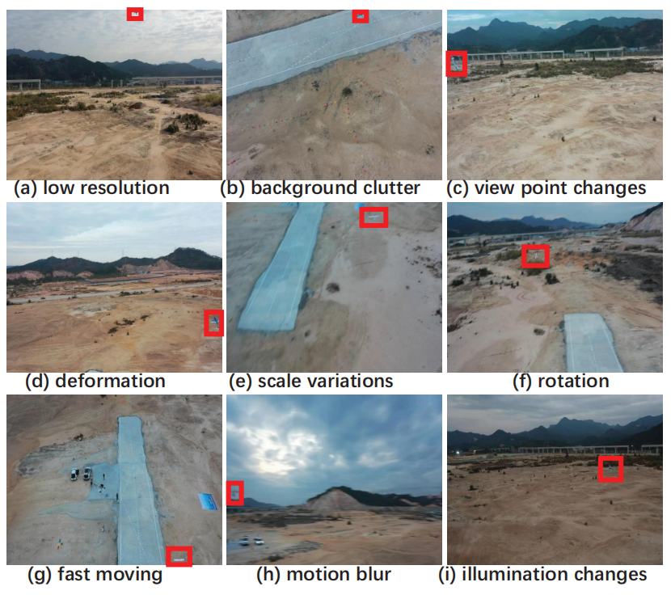
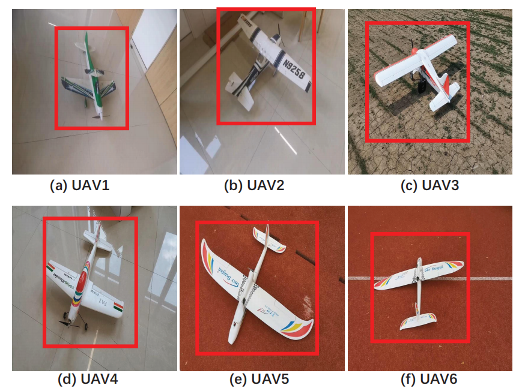
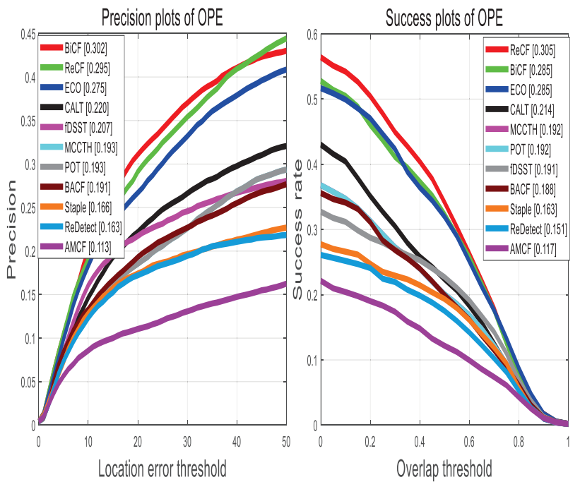
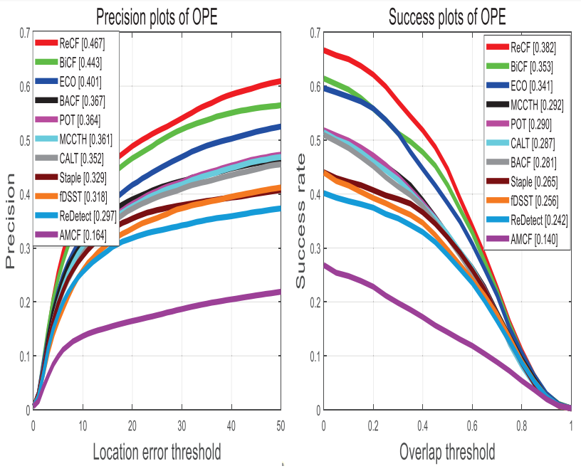
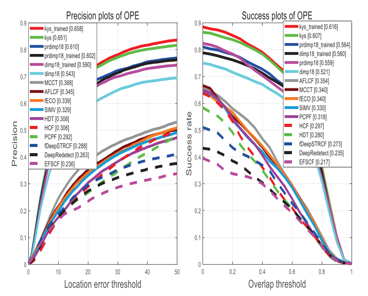
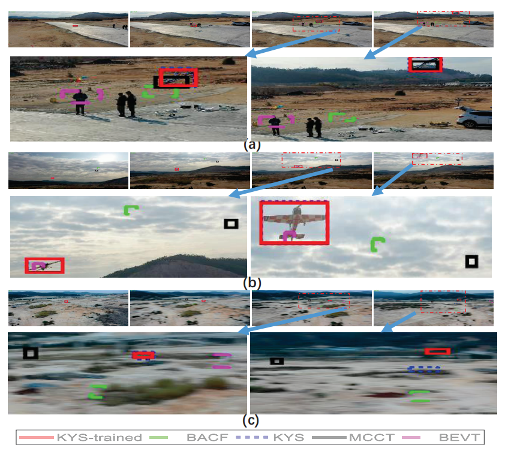

# UAV2UAV-2: A Large-Scale Benchmark for Fixed-Wing UAV-to-UAV Tracking

---

## 👨‍💻 Authors
[Yong Wang](https://github.com/hapless19),  Xiangyu Zhu (Sun Yat-sen University),  Zhiyang Sun (Sun Yat-sen University),  Robert Laganiere (University of Ottawa),  Lu Ding (Guangxi University)  
---

## 🖼️ Overview

  
   
  <em>Figure 1: Overview of UAV2UAV-2 tracking scenarios (covering 9 core challenges).</em>

---

## 📌 Abstract
Tracking fixed-wing unmanned aerial vehicles (UAVs) plays a pivotal role in aerospace applications such as airspace security, formation flight, and counter-UAV missions. However, the lack of large-scale, high-diversity benchmark datasets has hindered the development and comprehensive evaluation of UAV-to-UAV (UAV2UAV) tracking algorithms. To address this gap, we present **UAV2UAV-2**—a state-of-the-art benchmark dataset consisting of 49 high-definition video sequences (27k+ frames) and 4.8k+ training images. The dataset features diverse backgrounds, extreme motion patterns, and realistic imaging challenges (e.g., motion blur, low resolution, illumination variations) that are inherent to fixed-wing UAV tracking. We conduct extensive evaluations of 24 state-of-the-art tracking algorithms (11 hand-crafted feature-based, 13 deep learning-based) and fine-tune 3 representative trackers (KYS, Dimp18, PrDimp) on our training dataset. Experimental results demonstrate that dedicated training data significantly improves tracking performance, with KYS-trained achieving the best success rate (61.6%) and precision (65.8%). Our dataset and code aim to advance research in UAV2UAV tracking by providing a rigorous evaluation platform for future algorithms.

---

## 📂 Table of Contents
* [Introduction](#🚀-introduction)
* [Contributions](#💡-contributions)
* [Quick View (Dataset)](#📸-quick-view-dataset)
* [Experimental Results](#📊-experimental-results)
* [Dataset Download](#📥-dataset-download)
* [Citation](#📜-citation)
---

## 🚀 Introduction
Fixed-wing UAVs are widely used in civilian and military applications due to their long endurance and high maneuverability. However, UAV2UAV tracking—where a UAV tracks another fixed-wing UAV—poses unique challenges that distinguish it from generic object tracking:
- **Small & Featureless Targets:** Fixed-wing UAVs occupy <100 pixels in most frames, lacking distinct texture or shape features.
- **Dynamic & Complex Backgrounds:** Rapid ego-motion of the tracking UAV and diverse environments (sky, urban, rural) cause target-background blending.
- **Extreme Motion & Imaging Degradation:** Out-of-plane rotation, fast motion, and motion blur lead to severe target appearance changes.

Existing datasets either lack training data, cover limited scenarios, or fail to capture the specific challenges of fixed-wing UAV tracking. UAV2UAV-2 fills this gap by providing a large-scale, realistic benchmark for algorithm development and evaluation.

---

## 💡 Contributions
* **Large-Scale Benchmark Dataset:** Introduce UAV2UAV-2 with 49 test videos (27k+ frames, 3840×2160 resolution) and 4.8k+ training images, covering 9 core tracking challenges.
* **Comprehensive Algorithm Evaluation:** Benchmark 24 state-of-the-art trackers (hand-crafted and deep learning-based) to provide insights into their performance on UAV2UAV scenarios.
* **Effective Training Strategy:** Validate that fine-tuning trackers on dedicated UAV data improves performance, with open-sourced fine-tuned models (KYS-trained, Dimp18-trained, PrDimp-trained).
* **Rigorous Annotation:** Provide high-precision bounding box annotations via a three-stage process (manual annotation → visual inspection → refinement) to ensure reliability.

---

## 📸 Quick View (Dataset)
### Dataset Samples

  
   
  <em>Figure 2: Sample frames from UAV2UAV-2.</em>

### Dataset Specifications
| Attribute | Details |
|-----------|---------|
| Test Videos | 49 sequences (30fps) |
| Total Frames | 27,000+ |
| Image Resolution (Test) | 3840×2160 (4K) |
| Training Images | 4,800+ (1280×720 resolution) |
| UAV Models | 6 types of fixed-wing UAVs |
| Covered Challenges | 9 types (low resolution, motion blur, illumination variation, background clutter, viewpoint change, deformation, scale variation, rotation, fast moving) |

---

## 📊 Experimental Results
### Quantitative Comparison

  
   
  <em>Figure 3: Success and precisions plots of the tracking results on the UAV2UAV-2 dataset with 11 kinds of hand-crafted based tracking algorithms.</em>

  
   
  <em>Figure 4: Success and precisions plots of the tracking results on the UAV2UAV-1 and UAV2UAV-2 datasets with 11 kinds of hand-crafted based tracking algorithms.</em>

  
   
  <em>Figure 5: Success and precisions plots of the tracking results on the UAV2UAV-2 dataset with 15 kinds of deep-learning based tracking algorithms.</em>

  
   
  <em>Figure 6: Success and precisions plots of the tracking results on the UAV2UAV-1 and UAV2UAV-2 datasets with 15 kinds of deep-learning based tracking algorithms.</em>

### Visualization

  
   
  <em>Figure 7: Qualitative results of five methods in three typical difficult challenges.</em>

---

## 📥 Dataset Download
The full dataset (test videos, training images, annotations) and pre-trained models are available on GitHub Releases:  
[UAV2UAV-2 Dataset]

## 📜 Citation
If you find our work or dataset useful for your research, please cite:
@inproceedings{li2025aerial,
  title={Tracking A Fixed-Wing Unmanned Aerial Vehicle: An Experimental Evaluation},
  author={Wang, Y. and Zhu, X. and Sun, Z. and Robert, L. and Lu, D.},
  booktitle={},
  year={2025}
}
